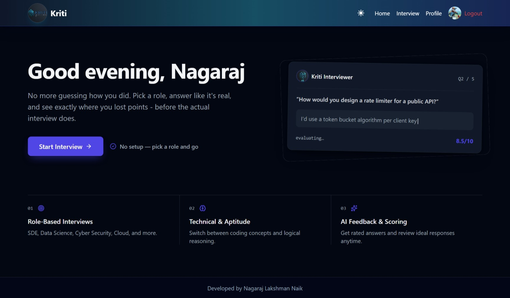
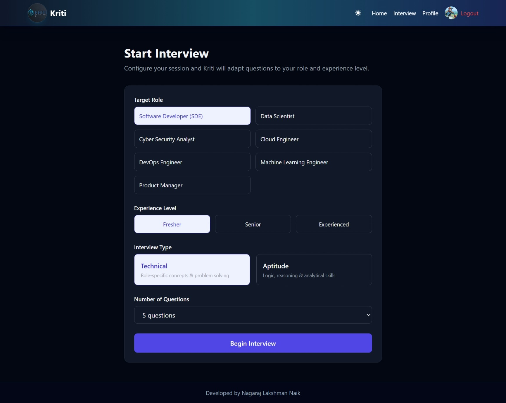
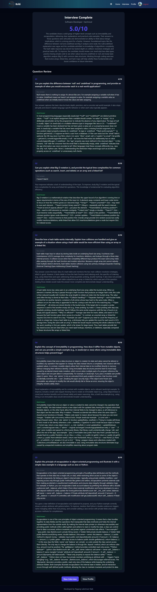
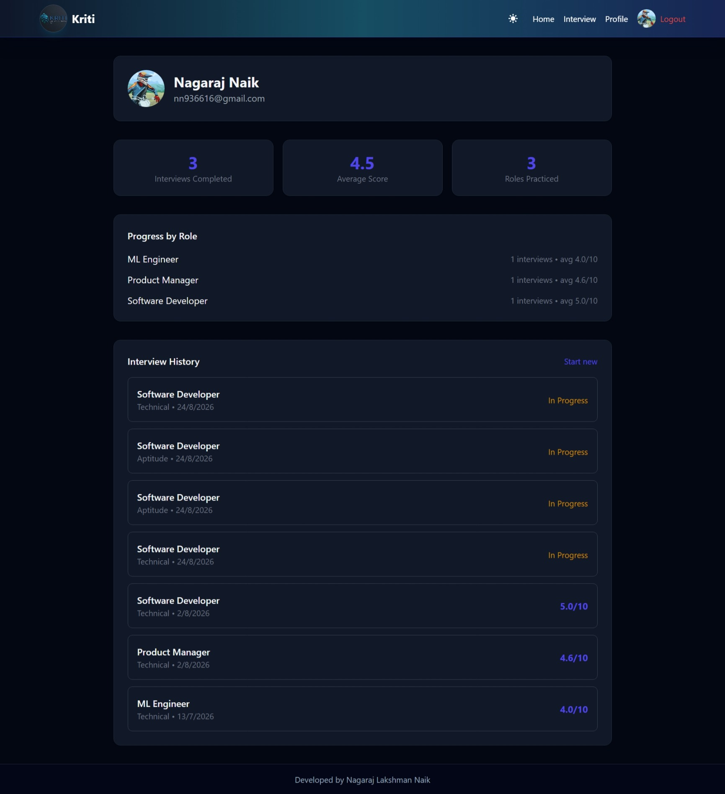

# KRITI – AI Interview Preparation Platform

**Live Demo:** [https://kriti-egzt.onrender.com](https://kriti-egzt.onrender.com)

**Kriti** is an AI‑powered interview preparation platform built with the **MERN stack**. It enables job seekers to practice technical and aptitude interviews through role‑based mock sessions, real‑time AI‑generated questions, instant feedback, and detailed performance reviews.

---

## 📌 Overview

Kriti provides a realistic, guided environment for candidates to sharpen their interview skills. With a modern React frontend and a robust Node.js/Express backend, the platform integrates MongoDB for persistence and Groq AI for intelligent question generation and evaluation.

Key capabilities include:

- Fast and secure one-click Google OAuth authentication
- Role‑based interview sessions (e.g., Software Developer, Data Scientist, Cloud Engineer)
- AI‑generated questions tailored to role and experience level
- Automated answer evaluation with scoring and constructive feedback
- Interview history tracking with performance insights

---

## 🚀 Features

- **Role‑based interview setup**: Choose from multiple positions and experience levels
- **Technical & aptitude modes**: Practice both coding and problem‑solving interviews
- **Personalized question generation**: Adaptive to user profile and skill level
- **AI feedback engine**: Ratings, suggestions, and improvement guidance for each answer
- **Comprehensive review page**: Overall assessment, ideal answers, and growth insights
- **Secure user experience**: Protected routes and authenticated sessions

---

## 🖼 Screenshots

| Home | Interview Session |
|---|---|
|  |  |

| Feedback & Review | Profile |
|---|---|
|  |  |

---

## 🛠 Tech Stack

**Frontend**
- React.js (with Vite)
- React Router
- Tailwind CSS
- Axios
- React Hot Toast

**Backend**
- Node.js & Express.js
- MongoDB with Mongoose
- JWT Authentication
- Passport.js (Google OAuth)
- @google/generative-ai (Google Gemini AI SDK for interview generation & evaluation)

---

## 📂 Project Structure

```text
KRITI/
├── backend/
│   ├── src/
│   │   ├── controllers/
│   │   ├── models/
│   │   ├── routes/
│   │   ├── services/
│   │   └── config/
│   └── package.json
├── frontend/
│   ├── src/
│   │   ├── components/
│   │   ├── context/
│   │   ├── pages/
│   │   └── utils/
│   └── package.json
└── README.md
```

---

## ⚙️ Prerequisites

- Node.js 18+
- npm 10+
- MongoDB (local instance or Atlas)
- Google Gemini API key (from Google AI Studio)
- Google OAuth credentials (Google Cloud Console)

---

## 🔑 Environment Variables

Create a `.env` file in the **backend** directory:

```env
PORT=5000
NODE_ENV=development
MONGODB_URI=your_mongodb_connection_string
JWT_SECRET=your_jwt_secret
CLIENT_URL=your_frontend_url
GEMINI_API_KEY=your_gemini_api_key
GEMINI_MODEL=gemini-3.6-flash

GOOGLE_CLIENT_ID=your_google_client_id
GOOGLE_CLIENT_SECRET=your_google_client_secret
GOOGLE_CALLBACK_URL=your_backend_url/api/auth/google/callback
```

---

## 🖥 Installation

1. Clone the repository
   ```bash
   git clone <your-repo-url>
   cd KRITI
   ```

2. Install backend dependencies
   ```bash
   cd backend
   npm install
   ```

3. Install frontend dependencies
   ```bash
   cd ../frontend
   npm install
   ```

---

## ▶️ Running the Application (Local)

Start the backend server:
```bash
cd backend
npm run dev
```

Start the frontend development server:
```bash
cd frontend
npm run dev
```

---

## 🌐 Deployment

Kriti is deployed on **Render** for production hosting.

- **Frontend & Backend**: Hosted on Render with automatic builds from the GitHub repository
- **Database**: MongoDB Atlas for cloud persistence
- **Environment Variables**: Configured securely in the Render dashboard
- **Live Demo**: [https://kriti-egzt.onrender.com](https://kriti-egzt.onrender.com)

---

## 📖 Usage

1. Register or log in to your account
2. Select role, experience level, and interview type
3. Begin a mock interview session
4. Answer AI‑generated questions
5. Receive instant feedback and review performance

---

## 🔗 API Endpoints

Authentication & interview routes under `/api`:

- `POST /api/auth/register`
- `POST /api/auth/login`
- `POST /api/auth/forgot-password`
- `POST /api/auth/reset-password/:token`
- `POST /api/interviews/start`
- `POST /api/interviews/:id/answer`
- `GET /api/interviews/:id/review`

---

## 🧑‍💻 Author

Created by **Nagaraj Lakshman Naik**
Passionate about building practical projects that combine software engineering and AI.
Focused on creating scalable systems, intelligent applications, and professional documentation that showcase both technical and creative strengths.

---